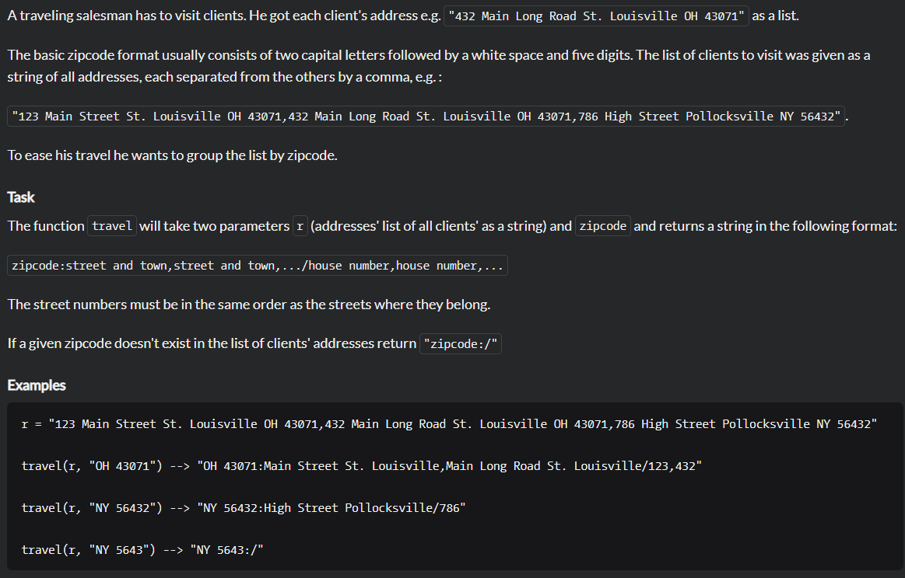
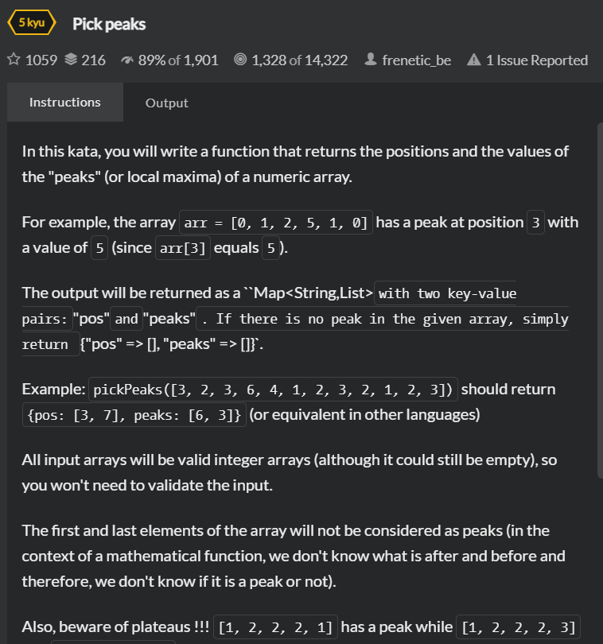

<h1>CodeWarsAllApl</h1>

--- <b>Java, JUnit, AssertJ</b> ---

it's an app where I try code chalange from CodeWars.com

---
All the challenges have unit based on difficulty. 
8 kyu is the easiest ones. 
1 kyu is the hardest ones.

I will try to write 200 challenges (from 22.03.2021 to X)

---
<h3>Application pasted:</h3>
1. Triangle (7kyu) - checking if from given parameters can be build triangle
   
2. Vowels (7kyu) - counting vowels from given sentence 
3. SpinWords (6kyu) - reverse word in sentence if length of the word is more than 5 
4. Positive (7kyu) - sum all numbers greater than 0 
5. Easy Wallpaper (7kyu) - return needed roll of wallpaper 
6. Break CamelCase (6kyu) - breaking sentence if is  
7. Highest Scoring Word (6kyu) - return word with highest points (a=1, b=2, c=3 etc.) from given sentence 
8. Find The Odd Int (6kyu) - return int that appears an odd number of times 
9. The Office III Broken Photocopier (7kyu) - change all "0" to "1" and "1" to "0" in given String 
10. Validate Credit Card Number (6kyu) - checking if card is validate by Luhn algorithm  

11. Duplicate Count (6kyu) - counting duplicate strings. If string appear more than two times its counting like one  
12. Scrambles (5kyu) - checking if from first given string is possible to get second given string  
13. Number Fun (7kyu) - get next square number after given  
14. The Super Market Queue (6kyu) - write a function to calculate the total time required for all the customers to check out  
15. Salesman Travel (6kyu) - write a function that gives you streets and numbers of street by zipcode  

16. StreetFighterSelection (6kyu) - changing figter position from given movegs and position  

<h3>Application in progress:</h3>
1.  PosAndPeaks (5kyu) - write a function that returns the positions and the values of the "peaks" (or local maxima) of a numeric array  

